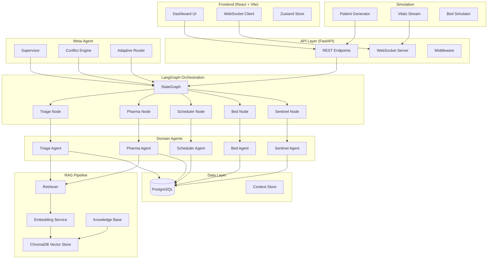

# Architecture Overview

## AETHER-Med System Architecture

## Data Flow

1. **Request arrives** at the FastAPI REST or WebSocket endpoint
2. **Meta-Agent Supervisor** determines which agents to invoke
3. **Adaptive Router** routes the task to appropriate agents
4. **LangGraph StateGraph** orchestrates the workflow through nodes
5. Each **node** invokes its corresponding **agent**
6. Agents may query the **RAG pipeline** for medical knowledge
7. **Conflict Engine** checks for inter-agent conflicts
8. Results flow back through the graph to the API
9. **WebSocket** pushes real-time updates to the dashboard

## Component Descriptions

### Frontend
- **Dashboard UI**: React-based medical dashboard with real-time widgets
- **WebSocket Client**: Maintains persistent connection for live updates
- **Zustand Store**: Lightweight state management

### API Layer
- **REST Endpoints**: CRUD for patients, agent management, health checks
- **WebSocket Server**: Real-time bidirectional communication
- **Middleware**: Request logging, CORS, error handling

### LangGraph Orchestration
- **StateGraph**: Defines the clinical workflow as a directed graph
- **Nodes**: Functions that invoke agents and update shared state
- **State**: TypedDict flowing through the graph with all clinical data

### Meta-Agent
- **Supervisor**: Top-level orchestrator deciding agent execution order
- **Conflict Engine**: Detects contradictions between agent outputs
- **Adaptive Router**: Routes tasks to the most appropriate agent

### Domain Agents
- **Triage Agent**: Patient priority assessment (ESI scoring)
- **Pharma Agent**: Medication recommendations and interaction checks
- **Scheduler Agent**: Appointment and procedure scheduling
- **Bed Agent**: Bed allocation and ward management
- **Sentinel Agent**: Anomaly detection and alert generation

### RAG Pipeline
- **Embedding Service**: Text → vector using sentence-transformers
- **ChromaDB**: Vector storage and similarity search
- **Retriever**: End-to-end query → results pipeline
- **Knowledge Base**: Medical documents, guidelines, protocols

### Data Layer
- **PostgreSQL**: Persistent storage for patients, agent logs
- **Context Store**: In-memory agent conversation context
